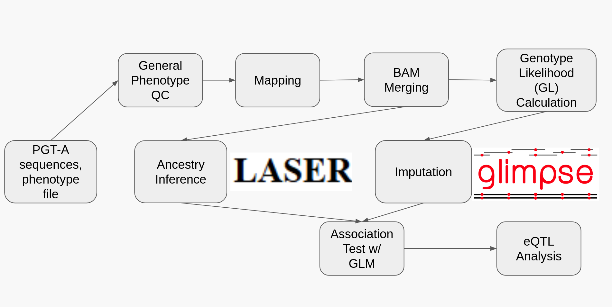

# PGTA-Aneuploidy
Pipeline for analyzing PGT-A data to study Aneuploidy

# PGT-A ulcWGS Analysis Pipeline

A reproducible analysis workflow for investigating genetic associations with embryo aneuploidy using ultra-low-coverage whole-genome sequencing (ulcWGS) data.

The pipeline integrates phenotype processing, sequencing analysis, genotype imputation, association testing, functional annotation, and downstream candidate-gene analysis.

## Workflow



The analysis is organized into five major stages:

### 1. Phenotype Analysis

Phenotype and clinical data are cleaned, filtered, and organized to define the final analysis cohort and patient-level embryo aneuploidy outcomes.

### 2. Sequencing Analysis

Sequencing data are processed from raw reads to analysis-ready genotype data. Major steps include:

* FASTQ to BAM mapping
* patient-level BAM merging, sorting, and indexing
* genotype-likelihood calculation
* GLIMPSE2 imputation and ligation
* ancestry inference and principal-component estimation

### 3. Association Analysis

Genotype and phenotype data are combined for genome-wide association testing.

Variant-level associations with embryo aneuploidy are evaluated using a quasibinomial generalized linear model while adjusting for relevant demographic, ancestry, and sequencing covariates.

Results are summarized using genome-wide association statistics and visualizations including Manhattan and QQ plots.

### 4. Variant & Gene Annotation

Variants passing the association threshold are functionally annotated and mapped to candidate genes using multiple complementary annotation resources.

The annotation workflow integrates information including:

* gene-based variant annotations
* population allele frequencies
* functional predictions
* clinical annotations
* eQTL and sQTL associations
* GWAS database matches
* human–mouse orthology
* mouse phenotype data
* oocyte expression data

These sources are aggregated into variant-level and gene-level candidate tables.

### 5. Candidate Gene Analysis

Final candidate variants and genes are examined through several downstream analyses:

* **Region & locus summaries** — significant variants are organized into genomic loci and linked to candidate genes.
* **Regional association plots** — locus-level association signals and nearby genes are visualized.
* **GO-term enrichment** — candidate genes are evaluated for enriched biological functions and pathways.
* **Literature review** — candidate genes are reviewed for existing evidence related to meiosis, chromosome segregation, oocyte biology, fertility, and aneuploidy-related mechanisms.

## Documentation

Detailed documentation is provided for each stage of the workflow, including:

* required inputs and generated outputs
* analysis procedures
* command-line and script usage
* quality-control checks
* troubleshooting encountered during pipeline development
* reproducibility notes

The documentation is designed so that each major stage can be understood independently while preserving the dependencies between stages.

## Repository Structure

Each directory has it's own corresponding README file

```text
.
├── pipeline/
│   ├── phenotype/
│   ├── bam_merge/
│   ├── sequencing/
│   ├── ancestry/
│   ├── GLM/
│   ├── annotation/
└── README.md
```

Large sequencing datasets, intermediate files, private paths, credentials, and other environment-specific resources are not included in the public repository.

## Reproducibility

Scripts and documentation are organized according to the order in which the analysis is performed. Environment-specific paths and computational-resource settings may need to be modified before running the workflow on another system.

Where possible, intermediate validation and quality-control steps are documented alongside the corresponding analysis stage.

## Citation

Citation and publication information will be added when available.
